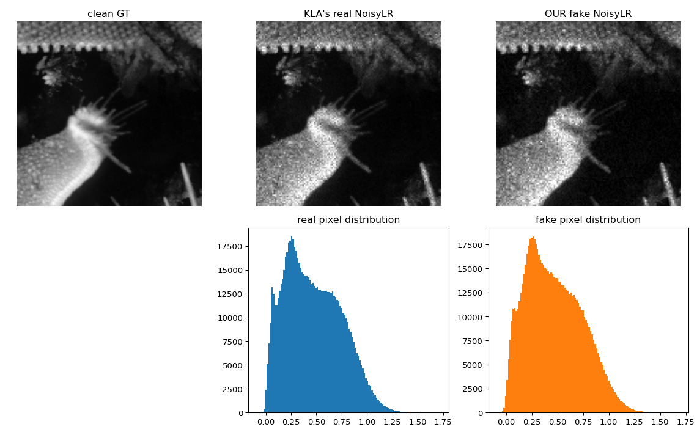

# AI-Based Restoration of Degraded Images

**SEMICON India Hackathon 2026 — Problem Statement 01 (KLA)**
Team **TEAM_NAME**

Single-stage restoration of speckle-degraded, 2×-downsampled greyscale images.
A modified NAFNet takes the degraded low-resolution image and produces a clean
full-resolution image in one pass.

| | |
|---|---|
| Architecture | NAFNet-w32, pixel-shuffle ×2 head, bicubic residual skip |
| Parameters | *(fill in from training log)* |
| Inference | *(fill in ms/image)* |
| val_hard SSIM / PSNR / LPIPS | *(fill in)* |

---

## Quick start

```bash
git clone https://github.com/<user>/kla-image-restoration.git
cd kla-image-restoration
pip install -r requirements.txt

# restore a directory of degraded images
python evaluate.py /path/to/test_images /path/to/output_dir
```

`evaluate.py` takes the test-image directory and the output directory as
positional arguments, loads `weights/best.pt`, and writes one restored image
per input using the **same filename**. It requires no edits to run.

Model weights are tracked with Git LFS. If `weights/best.pt` is a small text
pointer file, run `git lfs install && git lfs pull`.

---

## Approach

### 1. Recover the degradation operator before training anything

The training pairs are generated by a fixed pipeline with random parameters.
Rather than guess it, we measured it.

For a single pixel, the error between the degraded image and the correctly
downsampled clean image is

```
r = I·(g − 1) + n         g ~ Gamma(L, 1/L)   mean 1, variance 1/L
                          n ~ Normal(0, σ²)
```

so its variance is linear in `I²`:

```
var(r) = I²·(1/L) + σ²
```

Binning pixels by intensity and regressing the residual variance against `I²`
recovers `1/L` as the slope and `σ²` as the intercept. `scripts/analyze_degradation.py`
implements this and self-tests against synthetic data with known parameters
before being trusted (L recovered to within 3.6%).

**Measured on 3,200 training pairs:**

| Parameter | Value | Confidence |
|---|---|---|
| Speckle L | **36.7** (per-image 21.7–53.8) | ±4% |
| Gaussian σ | **≈0.018** | poor — 0.010–0.024 depending on fit settings |
| Downsampling | smooth (averaging), not pixel-picking | high |
| Which smooth kernel | **not identifiable** | box/bilinear/bicubic/lanczos are indistinguishable at this scale |

The kernel result is an honest negative. Rather than guess, we randomise over
all four during synthesis, which also improves robustness to unseen data.
σ is reported as a range rather than a point estimate because a sensitivity
sweep showed it moving by a factor of two under reasonable fitting choices.

### 2. Manufacture training data

Knowing the operator turns 3,200 fixed pairs into an unlimited supply. We
apply it to DIV2K photographs, re-randomising the damage **every time an image
is drawn**, so the network never sees the same noise realisation twice and
cannot memorise a noise pattern.

Sampling ranges are deliberately wider than measured (L ∈ [10.9, 107.6],
log-uniform) so that unusual test images remain inside the training
distribution. Roughly 25% of each batch is genuine KLA pairs, which anchors
the model to the real distribution and guards against over-fitting our own
reconstruction of the operator.

`scripts/verify_recipe.py` closes the loop: synthetic degradations match the
real ones on mean (to 4 decimal places), spread (2.4%) and negative-pixel
behaviour.



### 3. Architecture choices

Single stage — degraded LR in, clean HR out. A denoise-then-upscale cascade
doubles latency and compounds errors.

* **Signed log channel.** Speckle is multiplicative, so a logarithm converts
  it to additive noise. We use `sign(x)·log1p(|x|)` rather than
  `log1p(clamp(x, 0))` because ~70% of degraded images contain negative
  pixels; clamping would discard that information.
* **Pixel-shuffle ×2 head.** The network body runs at low resolution; only the
  final layer expands. Upscaling first would cost 4× the compute.
* **Bicubic residual skip, zero-initialised head.** The network predicts only
  the correction to a bicubic upsample. Residuals transfer across image
  sources far better than absolute intensities, and training begins from a
  sensible baseline rather than noise.
* **Median/MAD per-image normalisation.** Speckle produces extreme bright
  outliers that distort mean and standard deviation; the median does not
  notice them.
* **No adversarial training, deliberately.** A GAN would improve LPIPS by
  synthesising plausible texture. In defect inspection, a hallucinated
  particle is a worse failure than a slightly soft image, because an engineer
  may act on it. Fidelity is the correct trade here.

### 4. Loss

| Term | Weight | Purpose |
|---|---|---|
| Charbonnier | 1.00 | primary reconstruction term |
| FFT L1 | 0.05 | penalises the "blur it away" shortcut |
| SSIM | 0.10 | directly targets a scored metric |
| LPIPS | 0.02 | perceptual quality; enabled for the final 20% of training only |

### 5. Validation that predicts the leaderboard

Training samples are crops of a smaller number of source photographs, in runs
of consecutive indices — neighbouring samples correlate at +0.177 against a
random-pair noise floor of 0.000.

A random split would therefore place near-duplicate crops on both sides and
produce a validation score that means nothing. Instead we hold out a
**contiguous block** of indices, which is guaranteed to contain whole source
photographs without relying on fragile cluster detection.

| Set | Size | What it measures |
|---|---|---|
| train | 2,639 | — |
| val_easy | 81 | held-out crops of *seen* photos — confirms learning |
| **val_hard** | **480** | *unseen* photos — the only number that predicts the test set |

Checkpoints are selected on `val_hard`. Selecting on `val_easy` would pick the
most over-fitted model.

### 6. Inference-time engineering

Scoring measures the whole script — startup, imports, model load, disk I/O and
inference — not just the forward pass.

* `torch.compile` is **not** used: its 30–60 s warm-up falls inside the
  measured window.
* `evaluate.py` imports only `torch` and `numpy`. Metric libraries
  (`lpips`, `scikit-image`) and plotting are confined to training code.
* Weights load directly to device; `channels_last`; `cudnn.benchmark`;
  bf16 autocast; images bucketed by size and batched.
* No test-time augmentation — ~0.15 dB for 8× the latency is a poor trade.

---

## Repository layout

```
├── evaluate.py              # KLA benchmarking entry point (input_dir, output_dir)
├── train.py                 # reproduces training
├── requirements.txt
├── src/
│   ├── degrade.py           # the measured degradation operator
│   ├── dataset.py           # synthetic / real / mixed datasets
│   └── model/nafnet_sr.py   # architecture + losses + metrics
├── scripts/
│   ├── inspect_data.py      # data format and sanity checks
│   ├── visualize_pairs.py   # side-by-side pairs and histograms
│   ├── analyze_degradation.py  # recovers L, σ and the kernel
│   ├── build_split.py       # source-aware train/val split
│   └── verify_recipe.py     # confirms synthetic ≈ real
├── configs/
│   ├── degradation_config.json
│   └── split.json
├── notebooks/kla_train_kaggle.ipynb
├── weights/best.pt          # Git LFS
└── outputs/                 # restored test images
```

## Reproducing

```bash
# 1. measure the degradation operator
python scripts/analyze_degradation.py --root data/train --n 200 \
       --out configs/degradation_config.json

# 2. build the source-aware split
python scripts/build_split.py --root data/train --out configs/split.json

# 3. confirm the recipe reproduces the real degradation
python scripts/verify_recipe.py --root data/train \
       --cfg configs/degradation_config.json --png docs/images/recipe_verification.png

# 4. train (see notebooks/kla_train_kaggle.ipynb for the Kaggle version)
python train.py --photos data/DIV2K_train_HR --real data/train \
       --cfg configs/degradation_config.json --split configs/split.json \
       --out weights --width 32 --epochs 30
```

## References

1. Chen et al., *Simple Baselines for Image Restoration* (NAFNet), ECCV 2022.
2. Agustsson & Timofte, *NTIRE 2017 Challenge on Single Image Super-Resolution:
   Dataset and Study* (DIV2K), CVPR Workshops 2017.
3. Zhang et al., *The Unreasonable Effectiveness of Deep Features as a
   Perceptual Metric* (LPIPS), CVPR 2018.
4. Wang et al., *Image Quality Assessment: From Error Visibility to Structural
   Similarity* (SSIM), IEEE TIP 2004.
5. Zhang et al., *Designing a Practical Degradation Model for Deep Blind Image
   Super-Resolution* (BSRGAN), ICCV 2021 — degradation randomisation.
