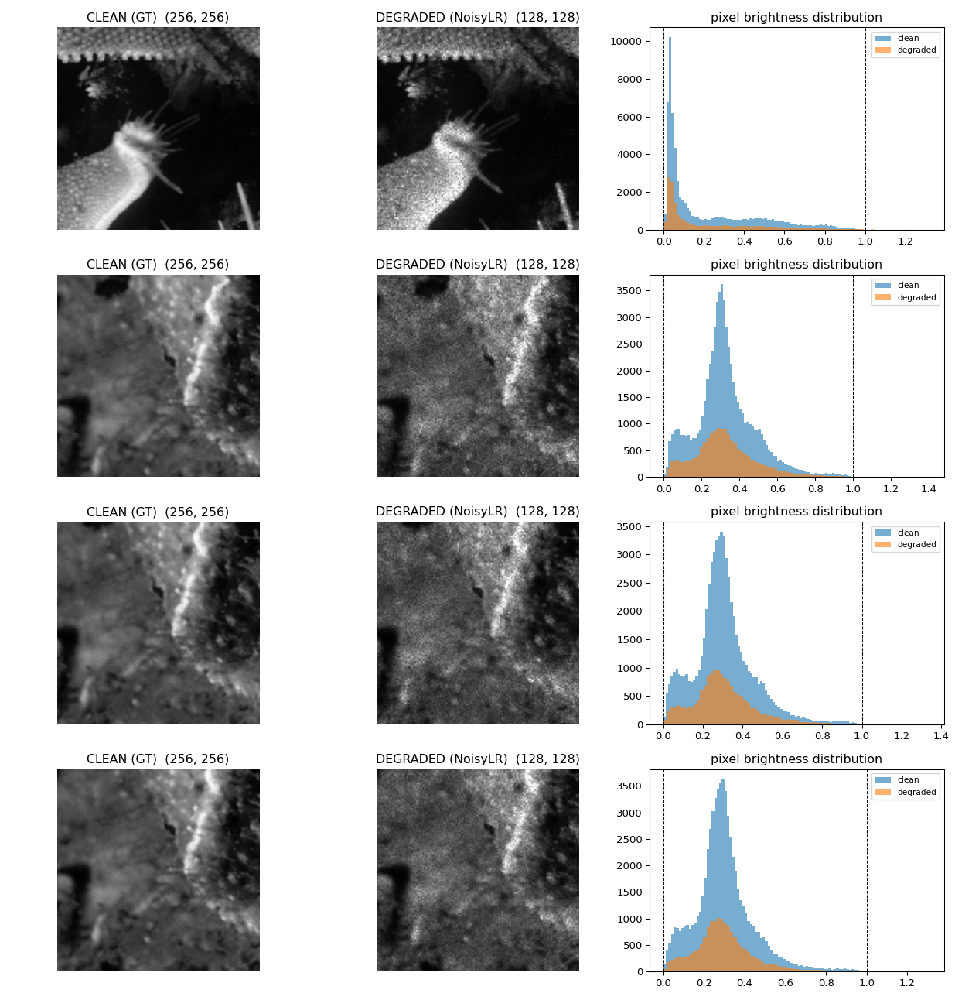

# Phase 0 — Degradation forensics

Everything here was measured from the 3,200 provided training pairs before any
model was trained. All numbers are reproducible with the scripts in `scripts/`.

## Data format

| | Ground truth | Degraded (NoisyLR) |
|---|---|---|
| Shape | 256×256 | 128×128 |
| dtype | float32 | float32 |
| Range | exactly [0.000, 1.000] | −0.080 … 1.714 |
| NaN / Inf | none in 3,200 | none in 3,200 |

**Ground truth is per-image min-max normalised** — every image has exactly one
pixel at 0.0 and exactly one at 1.0. Two consequences:

1. Clamp model output to [0, 1]. Any prediction outside is guaranteed error.
2. Min-max normalise synthetic crops *before* degrading them, or the synthetic
   GT distribution will not match the real one.

**72% of degraded images contain negative pixels.** Multiplicative noise on a
non-negative image can never produce a negative value, so this is direct proof
that additive Gaussian noise is present and non-negligible. Do not clamp the
input at zero, and do not use `log1p(clamp(x, 0))` for the log channel.

## The operator

```
clean_small = smooth_downsample(GT, ×0.5)
noisy       = clean_small · g + n
              g ~ Gamma(L, 1/L)      mean 1, variance 1/L
              n ~ Normal(0, σ²)
```

Evidence the multiplicative term has mean exactly 1: the degradation is
mean-preserving. Across samples, clean mean 0.2182 vs degraded 0.2184;
0.3265 vs 0.3268; 0.3054 vs 0.3047.

### Estimator

`var(r) = I²/L + σ²` is linear in `I²`. Bin pixels by intensity, take the
residual variance per bin, fit a weighted straight line. The steepest 25% of
pixels are excluded, because near edges the choice of downsampling kernel
dominates and would inflate the apparent noise.

Self-test against synthetic data with known parameters: L recovered to 3.6%,
σ to 26%.

### Results (200 pairs)

| kernel | L | σ | leftover structure |
|---|---|---|---|
| nearest | 37.67 | 0.02882 | 0.0519 |
| box | 37.30 | 0.01304 | 0.0437 |
| bilinear | 36.33 | 0.01682 | 0.0496 |
| bicubic | 37.30 | 0.01613 | 0.0492 |
| lanczos | 37.40 | 0.01684 | 0.0499 |

**L = 36.7**, per-image range 21.7–53.8.

"Leftover structure" is the lag-1 autocorrelation of the whitened residual. If
the assumed kernel is correct the residual should be white; a wrong kernel
leaves image structure behind. `nearest` scores worst and is ruled out. The
four smooth kernels are indistinguishable (0.0437–0.0499), so we randomise
over them rather than guessing.

### σ is poorly determined

Sensitivity sweep over the edge-rejection threshold:

| edge_reject | L | σ |
|---|---|---|
| 0.9 | 38.3 | 0.0175 |
| 0.75 | 38.3 | 0.0156 |
| 0.5 | 39.0 | 0.0125 |
| 0.3 | 39.8 | 0.0101 |

L is stable; σ moves by a factor of two. It is therefore stored as a range
(0 – 0.045) to randomise over, not as a point estimate.

## Source grouping

Consecutive samples are crops of shared source photographs.

| | median cosine similarity |
|---|---|
| neighbouring samples (i, i+1) | **+0.177** |
| random sample pairs | −0.000 |
| 95th percentile of random pairs | +0.401 |

34% of neighbouring pairs exceed the random-pair noise floor.

A random train/validation split would place near-duplicates on both sides. The
split is therefore a contiguous block: indices 0–2719 train, 2720–3199
`val_hard`. This is correct by construction and does not depend on cluster
detection, which is fragile — a single chained merge (A≈B, B≈C ⇒ A≈C) can
swallow half the dataset.

## Verification

Applying the fitted operator to real GT images and comparing against the real
degraded images:

| statistic | KLA real | reproduced | difference |
|---|---|---|---|
| mean | 0.4132 | 0.4132 | −0.0000 |
| std | 0.2029 | 0.1981 | −0.0049 |
| max | 1.3782 | 1.3637 | −0.0145 |
| images with negatives | 59% | 66% | +7% |


